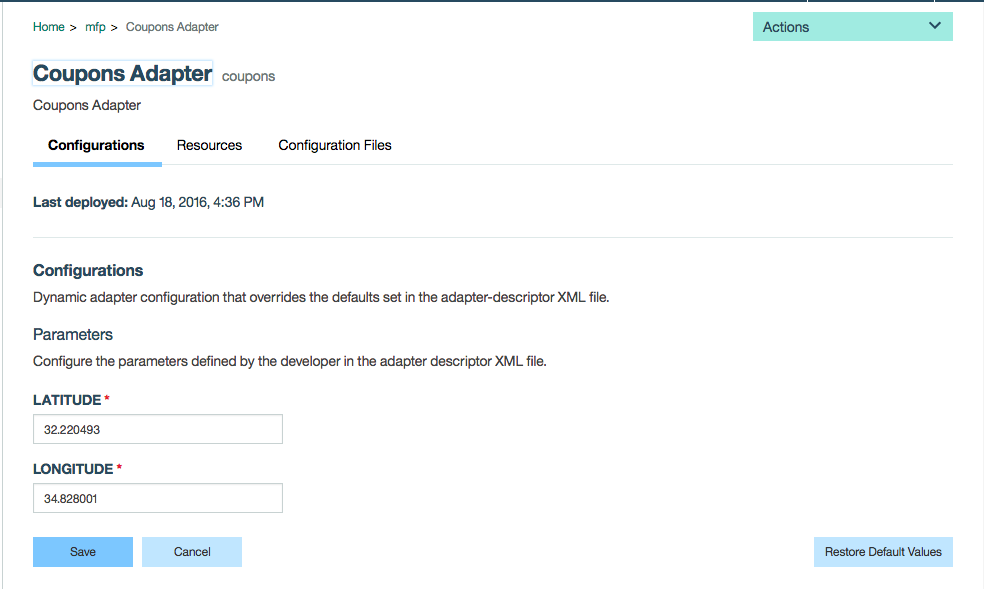
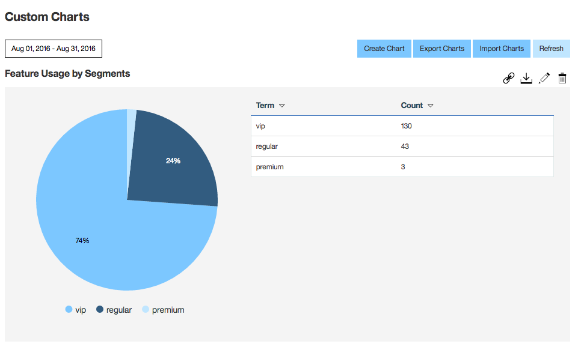
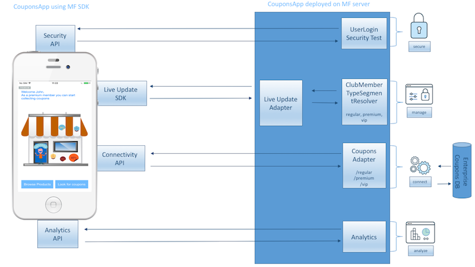

# Coupons App

The purpose of this sample is to show you how to gradually rollout a new feature, and measure its success, using MobileFirst Foundation capabilities. It also shows you how you can fine-tune aspects of the new feature in response to user feedback, without releasing a new version of your app. The new feature introduced in this sample app allows users to collect [Augmented Reality](https://www.wikiwand.com/en/Augmented_reality) coupons, using the phone camera to scan for coupons “in the field.” Similar to collecting Pokemon in the recent popular game [Pokemon Go](http://www.pokemongo.com/).

For more info see the following [blog](https://mobilefirstplatform.ibmcloud.com/blog/2016/09/11/liveupdate-and-analytics/).

 The MobileFirst Foundation features highlighted in this sample are [Live Update](https://mobilefirstplatform.ibmcloud.com/tutorials/en/foundation/8.0/using-the-mfpf-sdk/live-update/), [Analytics](https://mobilefirstplatform.ibmcloud.com/tutorials/en/foundation/8.0/analytics/), [Adapters](https://mobilefirstplatform.ibmcloud.com/tutorials/en/foundation/8.0/adapters/) and [Security Framework](https://mobilefirstplatform.ibmcloud.com/tutorials/en/foundation/8.0/authentication-and-security/).

### Demo

<a href="http://www.youtube.com/watch?feature=player_embedded&v=OsfWxKXv7jo" target="_blank">
</a>

### Prerequisites
1. [Installed Git](https://git-scm.com/book/en/v2/Getting-Started-Installing-Git)
2. Pre-installed IBM MobileFirst Platform [development environment](https://mobilefirstplatform.ibmcloud.com/tutorials/en/foundation/8.0/setting-up-your-development-environment/).
3. Understanding the IBM MobileFirst Platform [Authentication and Security](https://mobilefirstplatform.ibmcloud.com/tutorials/en/foundation/8.0/authentication-and-security/).
4. Understanding the IBM MobileFirst Platform [Java Adapters](https://mobilefirstplatform.ibmcloud.com/tutorials/en/foundation/8.0/adapters/java-adapters/).
5. Understanding the IBM MobileFirst Platform [Live Update](https://mobilefirstplatform.ibmcloud.com/tutorials/en/foundation/8.0/using-the-mfpf-sdk/live-update/).

### Running the sample

- Clone this repository   

 ```bash
 $ git clone https://github.com/mfpdev/liveupdate-and-analytics.git
 ```

- Deploy the `CouponsAdapter` adapter
  * Build and deploy the adapter using maven:
    * From a **Command-line**, navigate to the **CouponsAdapter** project's root folder
    * Build using maven by executing `mvn clean install`
    * Deploy the adapter into your MobileFirst server by running `mvn adapter:deploy` (assure that your MobileFirst
  server connection parameters are updated in the **pom.xml** file)
- Deploy the `UserLogin` Security Test Adapter (same instructions as `CouponsAdapter`)
- Deploy the `ClubMemberTypeSegmentResolver` adapter (same instructions as `CouponsAdapter`)

- Deploy the `Live Update Adapter` by following this  [link](https://mobilefirstplatform.ibmcloud.com/tutorials/en/foundation/8.0/using-the-mfpf-sdk/live-update/#adding-live-update-to-mobilefirst-server)

>Note: maven is just one way to build and deploy adapters, to learn more about adapters see the following [link](https://mobilefirstplatform.ibmcloud.com/tutorials/en/foundation/8.0/adapters/)

- Register the `CouponsApp` native iOS app
  * Register the application with [mfpdev CLI](https://mobilefirstplatform.ibmcloud.com/tutorials/en/foundation/8.0/using-the-mfpf-sdk/using-mobilefirst-cli-to-manage-mobilefirst-artifacts/):
    * From a **Command-line**, navigate to the **CouponsApp** project's root folder
    * Register the app by using by executing `mfpdev app register`

>Note: you can also register app using `MobileFirst Operations console` (Applications->new)

- Configure the `Live Update Settings`
  - Set the resolver adapter name:
    * From the [MobileFirst Operations console](http://localhost:9080/mfpconsole) go to **Adapters->Live Update Adapter** and set the **segmentResolverAdapterName** to be `ClubMemberTypeSegmentResolver`
  - Import the Live Update schema:
    * The scheme to import is located in the file **schema.txt**
    * Import the schema by executing the following curl command:

      ```bash
      curl -X PUT -d @schema.txt --user admin:admin -H "Content-Type:application/json" http://localhost:9080/mfpadmin/management-apis/2.0/runtimes/mfp/admin-plugins/liveUpdateAdapter/com.github.mfpdev.sample.CouponsApp/schema
      ```
  - Import the Live Update segments:
    * The segments to import are located in the file **segments.txt**
    * Import the segments by executing the following script (save the script to file first):

      ```bash
      #!/bin/bash
      segments_number=$(python -c 'import json,sys;obj=json.load(sys.stdin);print len(obj["items"]);' < segments.txt)
      counter=0
      while [ $segments_number -gt $counter ]
      do
          segment=$(cat segments.txt | python -c 'import json,sys;obj=json.load(sys.stdin);data_str=json.dumps(obj["items"]['$counter']);print data_str;')
          echo $segment | curl -X POST -d @- --user admin:admin --header "Content-Type:application/json" http://localhost:9080/mfpadmin/management-apis/2.0/runtimes/mfp/admin-plugins/liveUpdateAdapter/com.github.mfpdev.sample.CouponsApp/segment
          ((counter++))
      done
      ```
>Note: if you are using windows you need to have a bash environment installed.

- Security configuration
  * From [MobileFirst Operations console](http://localhost:9080/mfpconsole) go to **Applications->CouponsApp->iOS->Security(Tab)**. In `Scope-Elements Mapping` map scope `configuration-user-login` to UserLogin.  Do the same for scope `club-member-scope`.  
  

- Coupons Adapter configuration
  * From [MobileFirst Operations console](http://localhost:9080/mfpconsole) go to **Adapters->Coupons Adapter**. In `Configurations` set the `LATITUDE` and `LONGITUDE` to be values which is near your current location.  Those values will be used by the adapter to randomize coupons and gifts around your current location.  You can use site that offer this service such as [http://www.latlong.net/](http://www.latlong.net/).

    

### Using the sample

  * The sample allows customers to collect coupons of business / store in an appealing way using augmented reality.  When the `ar_coupon` feature is enabled (in Live Update Settings) to an audience segment such as regular/premium/vip. Users from the relevant segment can start pick up coupons by pressing the `Look for coupons` button.  

  * To be able to login just enter username which is equals the password, e.g: John/John. Pressing on the `Look for coupons` button will load augmented reality view with the coupons and gifts.  The user is divides into 3 segments: regular/premium/vip. The user segment is defined by the first letter of his username and is implemented in `ClubMemberTypeSegmentResolverResource`:

  ```java
  char firstCharacter = authenticatedUser.getDisplayName().charAt(0);

  boolean isPremiumMember = firstCharacter >= 'I' && firstCharacter <= 'Q' || firstCharacter >= 'i' && firstCharacter <= 'q';
  boolean isVIPMember = firstCharacter >= 'R' && firstCharacter <= 'Z' || firstCharacter >= 'r' && firstCharacter <= 'z';

  return isVIPMember ? "vip" : isPremiumMember ? "premium"  : "regular";
  ```

### Live Update configurations options

* Summary tables showing the options available for this application:

| Feature Name   |      Id      |  Description |
|:----------|:-------------|:------|
| AR coupon |  ar_coupon | Displays augmented reality coupons near the store |

| Propery Name   |      Id      |  Description |
|:----------|:-------------|:------|
| Club Image |  clubImage | Image for club type (regular/premium/vip) |
| Coupon Pickable Radius|  discountPickableRadius | The radius in meters to be able pick a discount coupon |
| Gift Pickable Radius |  giftPickableRadius | The radius in meters to be able pick a gift |
| The coupons resource adapter URL |  coupons_adapter_url | Return JSON of coupons for the relevant segment|
| Welcome Message |  welcomeMessage | Welcome message for the app user (after login)|


  * In [MobileFirst Operations console](http://localhost:9080/mfpconsole) you can go to `Live Update Settings` under **Applications->CouponsApp->Live Update Settings** and change features and properties to see how they affect the app.  e.g.: change the discountPickableRadius and reload the coupons to see how it affect the distance of coupons which can be picked.

### Using Analytics

  * After using the app for a while you go to the [MobileFirst Analytics Console](http://localhost:9080/analytics/console/dashboard) and build your custom charts like below:
  

### Architecture


### External dependencies frameworks used in the app

* [HDAugmentedReality](https://github.com/DanijelHuis/HDAugmentedReality)

* [SwiftyJSON](https://github.com/DanijelHuis/HDAugmentedReality)

### Supported Levels
IBM MobileFirst Foundation 8.0

### License
Copyright 2016 IBM Corp.

Licensed under the Apache License, Version 2.0 (the "License");
you may not use this file except in compliance with the License.
You may obtain a copy of the License at

http://www.apache.org/licenses/LICENSE-2.0

Unless required by applicable law or agreed to in writing, software
distributed under the License is distributed on an "AS IS" BASIS,
WITHOUT WARRANTIES OR CONDITIONS OF ANY KIND, either express or implied.
See the License for the specific language governing permissions and
limitations under the License.
